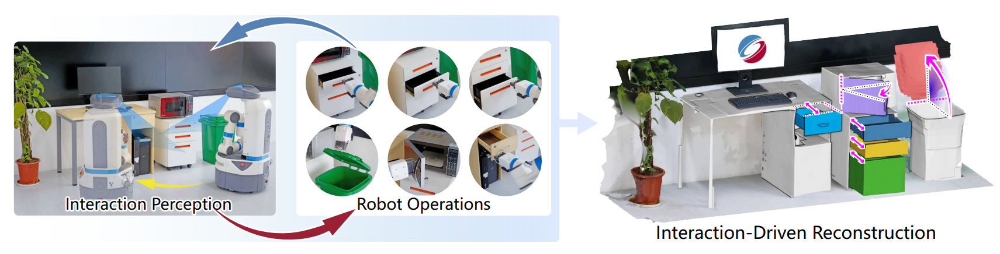

  <div align="center">
    <h1 align="center">
      Interaction-Driven Active 3D Reconstruction with Object Interiors
    </h1>
    <p align="center">
      <a href="https://salingo.me/"><strong>Zihao Yan</strong></a>
      ·
      <a href="https://github.com/JYILY"><strong>Fubao Su</strong></a>
      ·
      <a><strong>Mingyang Wang</strong></a>
      ·
      <a><strong>Hao Zhang</strong></a>
      ·
      <a href="https://csse.szu.edu.cn/staff/ruizhenhu/"
        ><strong>Ruizhen Hu</strong></a
      >
      ·
      <a href="https://vcc.tech/~huihuang/home"><strong>Hui Huang*</strong></a>
    </p>
    <h2 align="center">SIGGRAPH Aisa 2023</h2>
        <p align="center">
      <a href="https://arxiv.org/abs/2310.14700">
        
      </a>
      <a href="https://vcc.tech/research/2023/InterRecon">
        
      </a>
    </p>

_A fully automatic, active 3D reconstruction method._


  </div>
<br>

# 📌  Introduction
<div align="center">
  
</div>

We introduce a fully automatic, active 3D reconstruction method which integrates interaction perception from depth sensors, real robot-object interaction(e.g., opening drawers), and on-the-fly scanning and reconstruction to obtain a complete geometry acquisition of both the object exteriors and interiors.

<br>

# 🚀  Quickstart
## 1 Set up Environment.

```bash
# <1> clone project
git clone https://github.com/Salingo/Interaction-Driven-Reconstruction.git
cd Interaction-Driven-Reconstruction

# <2> [OPTIONAL] create conda enviroment
conda create -n IDR python=3.9
conda activate IDR

# <3> install pytorch according to instructions
# https://pytorch.org/get-started/

# <4> install requirements
pip install -r requirements.txt

# <5> install openpoints according to instructions
# https://github.com/guochengqian/openpoints

```
## 2 Download dataset
Our dataset was obtained by processing the [PartNet-Mobility](https://sapien.ucsd.edu/browse). The main processing script is based on the peojrct [virtual-3d-scanner](https://github.com/Salingo/virtual-3d-scanner). You can download the dataset from the link: [Google Drive](https://drive.google.com/file/d/1QtvB6djBZYNmOE6LwpCY83ej-etV4s_t/view?usp=drive_link) .

Unzip the file, the file structure should look like this:
```
Interaction-Driven-Reconstruction
  > data_raw
      > motion
      > pc_vscan_iter_front
```
## 3 Action Network
### 3.1 Generate the dataset
Rather than downloading our data, it is more convenient to generate it manually.
```bash
# In the root directory.
python gen_data/action/gen_score_batch.py
```
After executing the above code, we should have obtained a dataset in ```./data/action```.
### 3.2 Train the Critic Network
Before starting training, you need to modify the training configuration in the ```./config/experiment```. Our code is based on [lightning-hydra-template](https://github.com/ashleve/lightning-hydra-template), if you don't know how to modify the configuration, please refer to the repository.
```bash
# In the root directory
python src/train.py experiment=action_critic
```
After the training, you cloud see the result in ```./logs```. 

### 3.2 Train the Action Network
Training the action network is based on the critic network. You should find the best ckpt file of the critic network in the ```./logs```. And then setting it in the ```./config/experiment``` .
```bash
# In the root directory
python src/train.py experiment=action_critic
```

## 4 Segmentation Network
### 4.1 Generate the dataset
In order to train the segmentation neural network more conveniently, we preprocessed the original data and obtained the dataset of the segmentation network.
```bash
# In the root directory.
python gen_data/seg/gen_seg_data_batch.py
```
### 4.2 Train the Segmentation Network
After modifying the configuration file in ```./configs/experiment```, you can use the following command to train
```bash
# In the root directory
python src/train.py experiment=seg

# Or 
python src/train.py experiment=seg_wom

# Or 
python src/train.py experiment=seg_baseline
```
## 5 Completion Network
### 5.1 Generate the dataset
Generate the dataset of completion network is based on the dataset of segmentation network. After generating the dataset of segmentation network in 4.1, you could run the following code:
```bash
# In the root directory
python gen_data/com/gen_com_data.py

# Normalized  
python gen_data/com/norm_com_data.py
```
### 5.2 Train the completion network
```bash
# In the root directory
python src/train experiment=com
```
<br>
