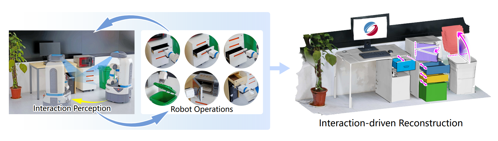

<div>
  <h1 align="center">Interaction-Driven Active 3D Reconstruction with Object Interiors</h1>
  <p align="center">
    <a href="https://salingo.me/"><strong>Zihao Yan</strong></a>
    ·
    <a href="https://github.com/JYILY"><strong>Fubao Su</strong></a>
    ·
    <a><strong>Mingyang Wang</strong></a>
    ·
    <a><strong>Hao Zhang</strong></a>
    ·
    <a href="https://csse.szu.edu.cn/staff/ruizhenhu/"><strong>Ruizhen Hu</strong></a>
    ·
    <a href="https://vcc.tech/~huihuang/home"><strong>Hui Huang*</strong></a>
  </p>
  <h2 align="center">SIGGRAPH Aisa 2023</h2>
  <div align="center">
    
</div>

## 📌 Environment preparation

```bash
# clone project
git clone https://github.com/Salingo/Interaction-Driven-Reconstruction.git
cd Interaction-Driven-Reconstruction

# [OPTIONAL] create conda environment
conda create -n IDR python=3.10
conda activate IDR

pip install -r requirements.txt

# install pytorch according to instructions
# [SEE] https://pytorch.org/get-started/
# [NOTE] we use the pytorch 2.0 and cuda 11.7 in ubuntu 20.04
# conda install -y pytorch=2.0.1 torchvision cudatoolkit=11.7 -c pytorch -c nvidia
# pip install torch-scatter -f https://data.pyg.org/whl/torch-2.0.1+cu117.html

# install openpoints
git clone https://github.com/guochengqian/openpoints.git
source install_openpoints.sh

```

## 🚀  Quickstart

```bash
python src/train.py experiment=seg_baseline

```
